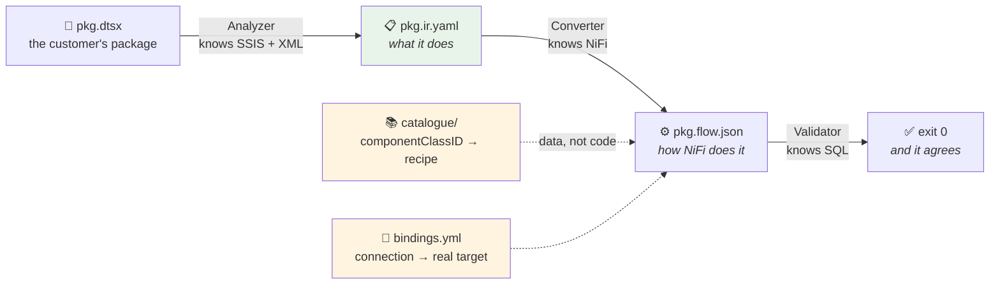
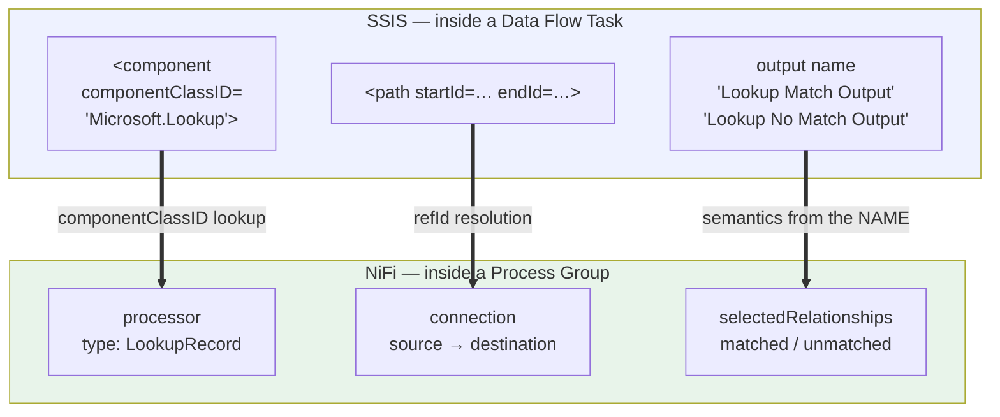
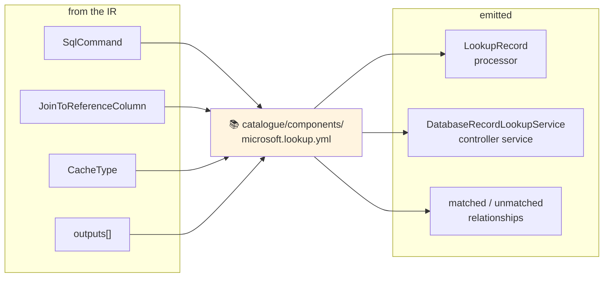
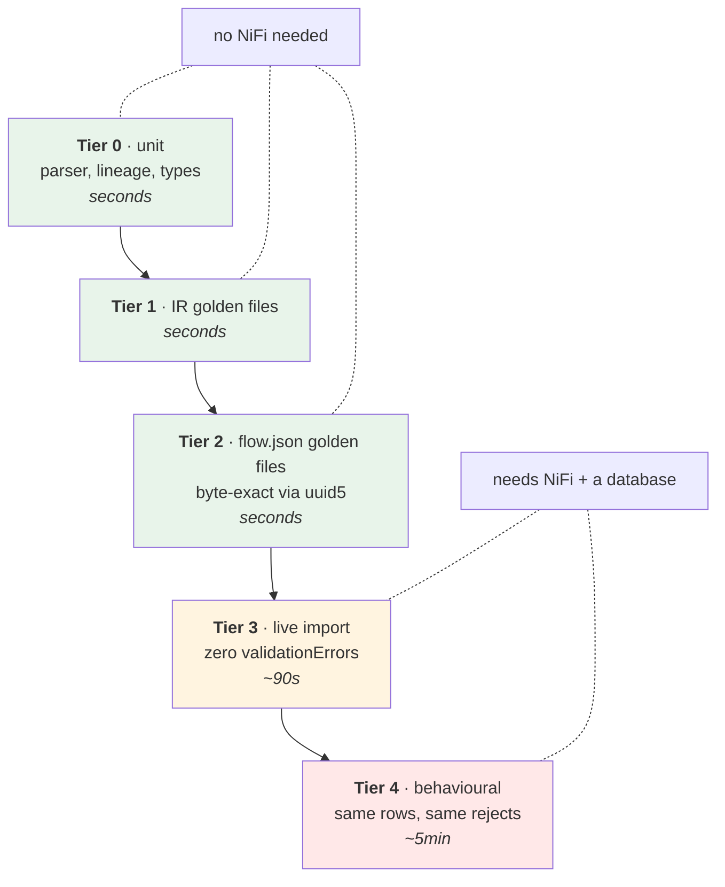
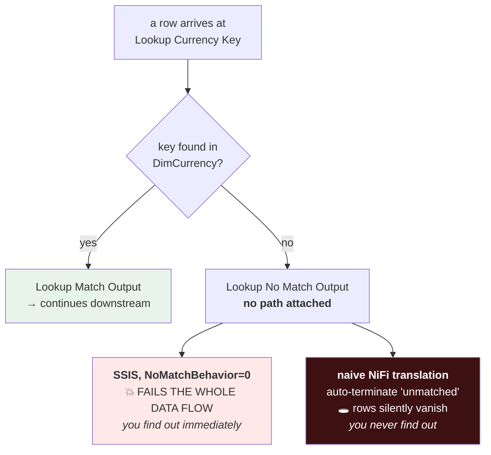

# DIAGRAM

A diagram-first tour of the converter. Five pictures, minimal words — read the
diagrams, use the text only as captions.

For running it, see [`README.md`](README.md).

## Contents

1. [The three stages](#1-the-three-stages)
2. [Why the translation is possible at all](#2-why-the-translation-is-possible-at-all)
3. [Where a recipe comes from](#3-where-a-recipe-comes-from)
4. [The five validation tiers](#4-the-five-validation-tiers)
5. [The disposition matrix — where rows go to die](#5-the-disposition-matrix--where-rows-go-to-die)

---

## 1. The three stages

One artifact per stage. Each is independently testable, and the boundary is the
point: the Analyzer knows nothing about NiFi, the Converter knows nothing about
XML.



**Why the IR exists in the middle.** You can hand `pkg.ir.yaml` to the person who
owns the SSIS package and ask *"is this what your package does?"* — without them
knowing NiFi exists. That review is impossible if the tool goes straight from
XML to a flow.

---

## 2. Why the translation is possible at all

A real `.dtsx` is a **named-edge DAG**. So is a NiFi flow. The shapes line up
almost element for element — which is the whole reason a deterministic compiler
is feasible rather than a guess.



The third row is the one people miss: SSIS encodes **branch meaning in the output
name**. `Lookup Match Output` and `Lookup No Match Output` are not decoration —
they are the equivalent of NiFi relationships, and every component also has an
**error output**, which maps onto the reject path directly.

**Two dialects, one meaning.** The same component is spelled differently across
SSIS versions, so everything downstream of the parser works in canonical names:

```
SSIS 2008   componentClassID="{671046B0-AA63-4C9F-90E4-C06E0B710CE3}"  ─┐
                                                                        ├─▶  Microsoft.Lookup
SSIS 2012+  componentClassID="Microsoft.Lookup"                        ─┘
```

---

## 3. Where a recipe comes from

The mapping is **data**. A reviewer can read one YAML file and know exactly what
will be emitted — which is what "auditable" means and what an ad-hoc AI
translation cannot offer.



Field for field, with real data on both sides:

| SSIS `Microsoft.Lookup` | NiFi `DatabaseRecordLookupService` |
|---|---|
| `SqlCommand` | `dbrecord-lookup-table-name` |
| `JoinToReferenceColumn` | `dbrecord-lookup-key-column` |
| `ReferenceMetadataXml` | `dbrecord-lookup-value-columns` |
| `CacheType` | `dbrecord-lookup-cache-size` |
| output `Lookup Match Output` | relationship `matched` |
| output `Lookup No Match Output` | relationship `unmatched` |

Property keys are copied from a NiFi flow **already proven to import and run**,
never from documentation or memory.

---

## 4. The five validation tiers

Three of the five need nothing running. That is deliberate: the fast tiers are
where the bugs actually get caught.



**Tier 3 is the cheapest credibility in the project.** Import the flow and assert
`invalidCount == 0`. That one check catches every wrong property key, missing
required property, unresolved service reference and bad bundle coordinate — the
entire class of bug that otherwise gets found by a human staring at a red canvas
during a demo.

**Exit codes are a contract:** `0` fully convertible · `3` needs a human · `4`
refused. `3` is non-zero on purpose — a pipeline must not be able to ship a
half-translated package by accident.

---

## 5. The disposition matrix — where rows go to die

**This is the picture worth studying.** Every other mistake in this tool is
loud. This one is silent.

An output with no path attached does **not** mean "nothing happens".



Both produce **identical row counts on the happy path**. They differ only when
something goes wrong — which is exactly when you need them to agree.

So every unconnected output is recorded in the IR with its SSIS consequence, and
the catalogue must state what NiFi does about it:

| SSIS setting | What SSIS does | What the generated flow must do |
|---|---|---|
| `NoMatchBehavior=0` | fails the data flow | route to the reject sink — **never** auto-terminate |
| `NoMatchBehavior=1` | rows go to the no-match output | wire `unmatched` onward |
| `errorRowDisposition=FailComponent` | fails the data flow | route `failure` to the reject sink |
| `errorRowDisposition=RedirectRow` | rows go to the error output | wire `failure` onward |
| `errorRowDisposition=IgnoreFailure` | row passes through | `route-to-success`, **no** unmatched branch |

The analyzer prints the consequence, not the flag value, because `NoMatchBehavior=0`
means nothing to a reader and *"fails the data flow on a miss"* means everything:

```
  [Lookup Currency Key]  Lookup  ✓
   ├─ Lookup Match Output ──▶ [Lookup Date Key]
   ├─ Lookup No Match Output  ✗ fails the data flow on a miss
   └─ Lookup Error Output ──▶ [Get Error Description]
```
